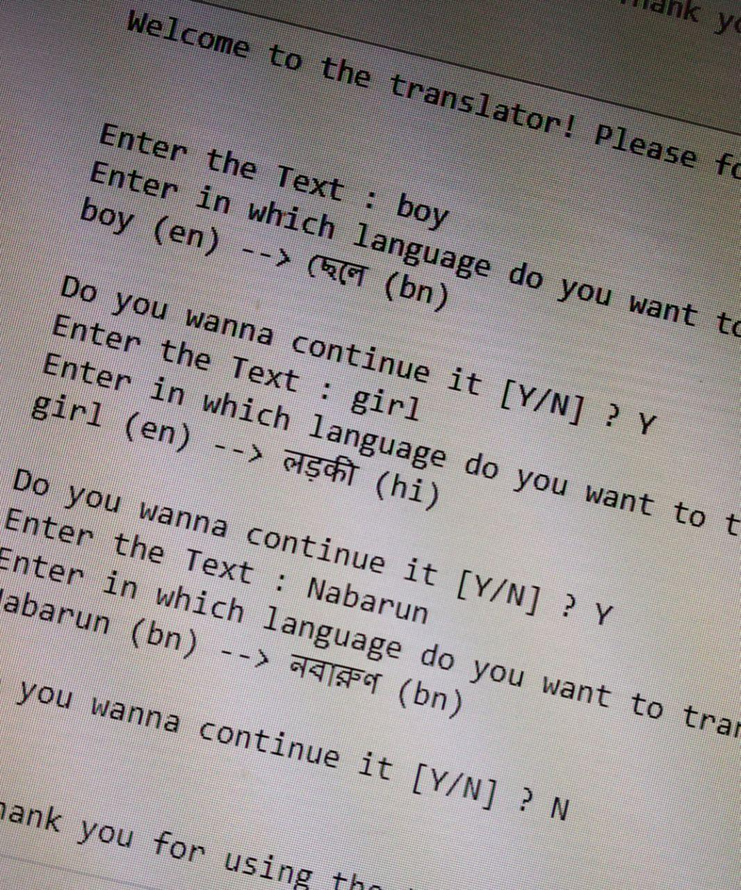

# Google-Translate-2.0
This is a project on Python where I have created my own version of Google Translate and named as Google Translate 2.0

## Contents :
- Changing languages by default
- Changing the languages as a phrase
- Detection of the language
- Automated Bot version of Google Translate
- Limitations

Hope you guys will like this project!

# abhisheks008
